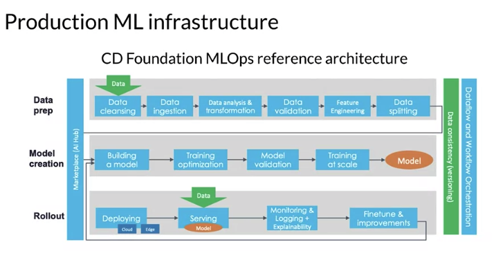

# 1. Intro: Machine Learaning Ops Data Lifecycle

|**Managing the entire life cycle of data** |**Modern software development**|
|---|---|
|Labeling|Scalability
|Feature space coverage|Extensibility
|Minimal dimensionality|Configuration
|Maximun predictive data|Consistency & reproducibility|Safety & security
|Fairness|Modularity
|Rare conditions|Testability|
----------
## Production ML Life-cycle
    Scoping => Data => Modeling => Deployment
----------
##  Production ML infrastructure
One version example of the ML dev process:

----------
##  PTF Extended(TFX)
is an end-to-end platform for deploying production ML pipelines:  
        data ingestion => data validation => feat.engineering => train model => validate model => push if good => serve model
- TFX libraries

- TFX Hello-world

-------
# 2. Collecting Data 
## Data Quality
- maximize predictive content
- remove non-informative data
- feature space coverage
 
 
### Dataset issues:
- inconsistent formatting:
    - e.g. is "zero" '0', '0.0' or 'zero'
- compounding errors from other ML models
- monitor data sources for system issues and outages
 
 
### Measure data effectiveness:
- Intuition abou tdata value can be misleading
    - which features have predictive values and which ones do not?
- Feature engineering helps to maximize the predictive signals
- Feature selection helps to measure the predictive signals

## Data Pipeline
## Data Collection and Monitoring
- Data availability and collection
    - what kind of/how much data is available?
    - how often does the new data come in?
    - is it annotated?
        - if not, ho whard/expensive is it to get it labeled?
- Translate user needs into data needs
    - data needed
    - features needed
    - labels needed
- Get to know your data
    - identify data sources
    - check if they are refreshed
    - consistency for values, units, and data types
    - monitor outliers and errors
## Responsible Data: Security, Privacy & Fairness
### Data Sourcing
- build synthetic dataset
- open source dataset
- web scraping
- build your own dataset
- collect live data

### Data Security and User Privacy
\* Data collection is not just about your model
- give user control of what data can be collected
- is there a risk of inadvertently revealing user data?
- protect personally identifiable information
    - aggregation - replace unique values with summary value
    - redaction - remove some data to create less complete picture

### Bias and Fairness  
    fair, accountable, transparent, explainable

**How ML system can fail:**
- Representational harm
    - ML system amplify or flag a certain stereotype of particular groups
- Opportunity denial
    - ML makes predictions that have negative real life consequences that could result in lasting impacts. 
- Disproportionate product failure
    - where the effectiveness of your model is really skewed so that the outputs happen more frequently for particular groups of users, you get skewed outputs more frequently essentially can think of as errors more frequently
- Harm by disadvantage
    -  where a system will infer disadvantageous associations between different demographic characteristics and the user behaviors around that
#### **Commit to Fairness**:
- make sure your models are fair
    - group fairness, equal accuracy
- bias in human labeled and/or collected data
- ML Models can amplify biases

#### **Reduce bias: Design fair labeling systems**
- accurate labels are necessary for supervised learning
- labeling can be done by:
    - automation
    - humans(raters):
        - generalists --> crowdsourcing tools
        - subject matter experts --> specialized tools, e.g. medical image labeling
        - users --> derived labels, e.g. stagging photos

-------
# 3. Labeling Data
## Case study: Online shoe retailer
- How to detect problems early on?
    - Slow problems: data drift, new competitor, etc...
    - Fast problems: censor goes bad, software updates, etc...
    - data chagnes:
        - trend and seasonality
        - distribution of features changes
        - relative importance of feature changes
    - world changes:
        - style change
        - scope and processes change
        - competitors change
        - business expands to other geos
- What are the possible causes?
- What can be done to solve these?
- Why "Understand" the model?
    - mispredictions do not have uniform cost to your business
    - the data you have is rarely the data  you wish you had
    - model objective is nearly always a proxy for your business objectives
    - some percentage of your customers may have a bad experience
-------
# 4. Validating Data

